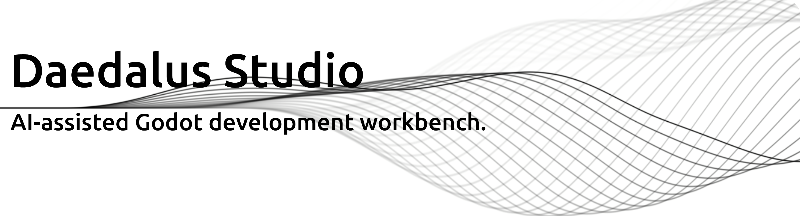
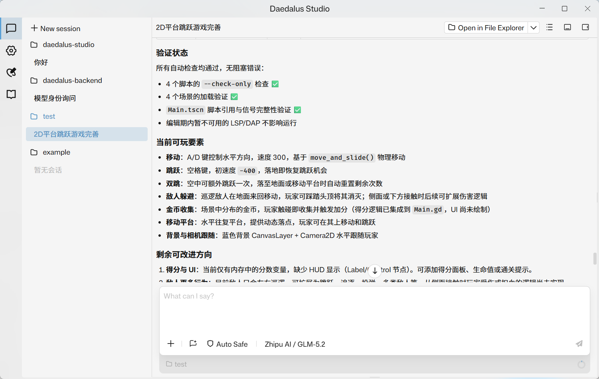

  

<h1 align="center">Daedalus Studio</h1>

  <b>AI-assisted Godot development workbench.</b>

  <a href="./README-CN.md" align="center">中文</a>

Daedalus Studio is a desktop workbench for building Godot projects with an AI assistant that understands project files, scenes, scripts, workflow steps, approvals, and validation results. It is designed for Godot-first editing instead of generic chat beside an editor.

## Why Daedalus Studio

- Godot-aware workspace context: open a Godot project, attach files, inspect scene structure, and let the assistant reason with `res://` paths.
- Scene and project operations: create or patch scenes, update project settings, work with Input Map and Autoloads, and inspect written results.
- Workflow mode: turn a request into reviewable steps, execute them with progress tracking, and keep a visible task checklist while the assistant works.
- Safer tool use: tool calls, file writes, terminal commands, image import, and plan approvals are surfaced in the timeline instead of being hidden inside chat text.
- Validation-oriented runs: Daedalus can run checks, inspect Godot output when available, and report when work is completed but not verified.
- Native desktop experience: managed backend startup, update checks, tray support, native notifications, and Windows installer updates.

## Godot-Focused Capabilities

Daedalus Studio is strongest when it is connected to a Godot workspace:

- understands Godot project layout and resource paths
- edits `.tscn`, `.tres`, `.gd`, `.gdshader`, and project configuration through backend tools
- supports Godot scene inspection and scene patch workflows
- analyzes project dependencies, script references, unused resources, and scene nodes through backend Godot tools
- can use a configured Godot executable for validation and editor/runtime checks
- keeps writes inside the selected workspace boundary

## Workflow

Workflow mode is built for multi-step Godot tasks:

1. Ask for a feature or fix, such as creating a main scene, adding UI, or wiring gameplay logic.
2. Daedalus prepares a plan or task flow when needed.
3. You approve, revise, or clarify before risky work continues.
4. The assistant executes tools and writes files through the backend.
5. The result view shows whether the task was verified, completed with warnings, or failed.

## Supported AI Providers

Daedalus Studio currently supports these built-in providers:

- DeepSeek
- Moonshot
- OpenAI
- Zhipu

Provider API keys are configured in **Settings -> Provider**. Model lists are loaded through the backend, and model capabilities such as tools, reasoning, vision, web search, and image generation are shown when available.

## Backend

Daedalus Studio talks to the Daedalus backend for sessions, tools, workflow execution, Godot operations, provider routing, and managed updates.

- Backend repository: [LuYingYiLong/daedalus-backend](https://github.com/LuYingYiLong/daedalus-backend)
- Managed backend package: `daedalus-backend`

Packaged builds can install and repair the managed backend automatically. In development builds, start the backend separately before using the app.

## Getting Started

1. Download the latest Windows installer from [Releases](https://github.com/LuYingYiLong/daedalus-studio/releases/latest).
2. Launch Daedalus Studio and let it prepare the managed backend.
3. Open **Settings -> Provider** and add an API key for one of the supported providers.
4. Open **Settings -> General** and set your Godot executable path if Daedalus cannot detect it.
5. Add or select a Godot workspace.
6. Start a chat and choose the model you want to use.

## Typical Tasks

- Build or revise a Godot scene from a natural-language request.
- Ask the assistant to inspect scene structure and fix missing nodes.
- Generate a plan for a gameplay feature, then approve the workflow.
- Analyze project dependencies or find script references.
- Review file changes and Git diffs before committing.
- Import generated image assets into the current Godot workspace.

## Notes

Daedalus Studio is still evolving quickly. For best results, keep the Studio app and the managed backend updated together, and review tool approvals when a task writes files, runs terminal commands, or changes project configuration.
