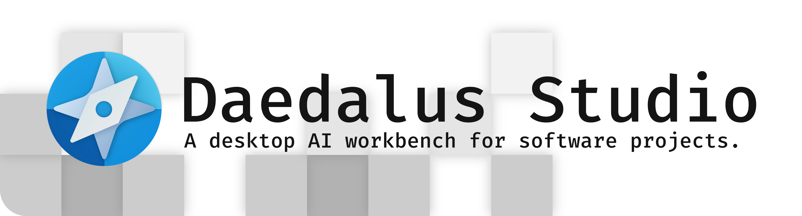
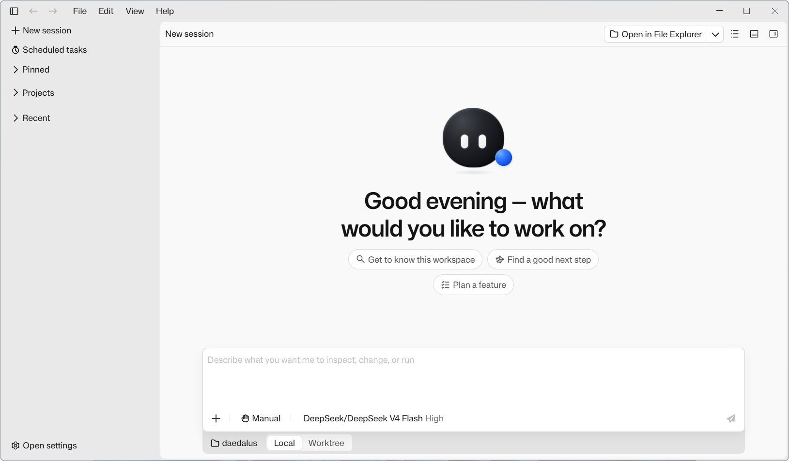
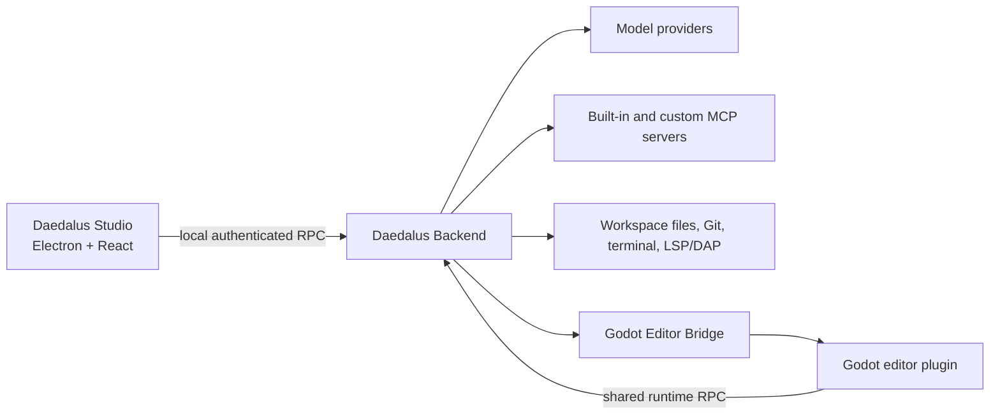

<p align="center">
  
</p>

<h1 align="center">Daedalus Studio</h1>

<p align="center">
  A desktop workbench for building Godot projects with an AI agent that can inspect, edit, run tools, and verify its work.
</p>

<p align="center">
  <a href="https://github.com/LuYingYiLong/daedalus-studio/releases/latest">
    
  </a>
  <a href="https://github.com/LuYingYiLong/daedalus-studio/actions/workflows/build-release.yml">
    
  </a>
  
  
  <a href="./LICENSE">
    
  </a>
</p>

<p align="center">
  <a href="https://github.com/LuYingYiLong/daedalus-studio/releases/latest"><strong>Download</strong></a>
  |
  <a href="#getting-started">Getting started</a>
  |
  <a href="#development">Development</a>
  |
  <a href="https://github.com/LuYingYiLong/daedalus-backend">Backend</a>
  |
  <a href="./README-CN.md">简体中文</a>
</p>



Daedalus Studio is a Godot-first AI development environment. It combines persistent project sessions, reviewable tool calls, file and Git diffs, terminal validation, MCP integrations, and a managed local backend in one native desktop application.

It is designed for work that should leave auditable project changes—not just a chat transcript.

## Highlights

- **Godot-aware workspaces** — understand `res://` paths, scenes, resources, scripts, project settings, Input Map, Autoloads, and project dependencies.
- **Agent runs with visible state** — simple edits stay lightweight; larger tasks can become structured workflows with Todo progress, approvals, verification, interruption recovery, and safe retry.
- **Review before trust** — inspect file patches, Git diffs, tool inputs, terminal output, warnings, and verification status in the conversation timeline.
- **Provider freedom** — use the built-in provider catalog or add OpenAI-compatible Chat Completions, OpenAI Responses, and Anthropic-compatible providers and models.
- **MCP and Skills** — connect custom MCP servers and enable project or personal skills without allowing either mechanism to bypass tool policy.
- **Persistent desktop workspace** — retain sessions, panel layouts, terminal tabs, archived conversations, workspace appearance, and unread completion state.
- **Managed integrations** — Studio verifies, installs, updates, repairs, and rolls back the Daedalus backend and the bundled Godot editor plugin.

## How It Fits Together


```mermaid
flowchart LR
    U["Daedalus Studio<br/>Electron + React"] -->|local authenticated RPC| B["Daedalus Backend"]
    G["Godot editor plugin"] -->|shared runtime RPC| B
    B --> P["Model providers"]
    B --> M["Built-in and custom MCP servers"]
    B --> W["Workspace files, Git, terminal, LSP/DAP"]
    B --> E["Godot Editor Bridge"]
    E --> G
```

Studio is the desktop client and lifecycle owner. The backend is the execution and persistence layer. The Godot plugin is a lightweight editor client and bridge. Their versions are pinned in each Studio release and checked before startup, so incompatible components are not silently mixed.

## Core Capabilities

### Agent and workflow

- Direct answers, read-only inspection, lightweight edits, and multi-stage workflows.
- Persistent run state with explicit routing, execution, verification, approval, and terminal states.
- Approval continuation and tool-budget continuation without replaying completed writes.
- Safe retry from interrupted runs using recorded evidence and write fingerprints.
- Session-specific model selection, context attachments, plans, Todo state, and layout preferences.

### Godot project work

- Inspect and edit scenes, resources, scripts, shaders, project settings, Input Map, and Autoloads.
- Use typed Editor Bridge patches with preflight checks, fingerprints, and Godot Undo/Redo transactions.
- Work with animation, TileMap/GridMap, audio buses, resources, editor navigation, and safe previews when the connected plugin advertises those capabilities.
- Run Godot headless checks and consume LSP, diagnostics, and read-only DAP information.
- Install or repair the bundled plugin only for projects targeting Godot 4.7 or newer.

### Review and workspace tools

- Inline file diffs and a dockable Git diff review panel.
- Session-scoped side and bottom panels with restorable tabs and dimensions.
- Integrated terminal tabs; terminal processes are isolated by session and are not restored after restart.
- Workspace tree with pinned, recent, archived, running, and unread session states.
- Native tray actions, notifications, automatic updates, and a separate Settings window.

### Providers, web search, MCP, and Skills

The provider and model list comes from the backend at runtime. The built-in catalog currently includes DeepSeek, Moonshot/Kimi, OpenAI, Zhipu AI, Alibaba Cloud Qwen, Volcengine Ark, MiniMax, StepFun, iFlytek Spark, OpenCode, Baidu Qianfan, and Xiaomi MiMo.

Model discovery and local capability overrides are supported. Independent web-search adapters are currently available for Zhipu AI and Xiaomi MiMo; search is explicit and remains disabled until configured.

Custom MCP servers and custom providers are treated as user-controlled integrations. Review their endpoints, commands, environment variables, and requested tool approvals before enabling them.

## Getting Started

### Requirements

- Windows 10 or Windows 11, x64.
- A supported model-provider account and API key.
- Godot 4.7 or newer for editor-plugin installation and the full Godot toolset.

### Install

1. Download `Daedalus-Studio-Setup-<version>.exe` from the [latest release](https://github.com/LuYingYiLong/daedalus-studio/releases/latest).
2. Install and launch Daedalus Studio.
3. Allow the first-run screen to verify and install the bundled backend.
4. Open **Settings → Providers**, configure a provider, and test the connection.
5. Add a workspace. For Godot projects, configure or auto-detect the Godot executable and install the bundled plugin from **Settings → Godot Projects**.
6. Create a session, choose a model, and describe the change or investigation you want.

Studio stores application preferences in Electron's user-data directory and Daedalus runtime data under `%USERPROFILE%\.daedalus`. API keys are stored through the operating-system credential store rather than in Daedalus JSON configuration.

## Safety Model

Daedalus is an agentic tool and can modify files or run commands after approval. Its safety model is based on enforceable boundaries:

- Workspace paths are validated before file, Git, Godot, and terminal operations.
- Read, verify, propose, write, and destructive tools have separate policies.
- Writes and risky external operations pass through the approval gateway.
- Scene and resource patches are preflighted before a single Undo/Redo transaction is committed.
- API keys and custom MCP secrets are kept out of ordinary configuration and logs.
- Missing validation is reported as a warning; a failed applicable validator is not presented as success.

You should still review changes and keep important projects under version control.

## Development

### Prerequisites

- Node.js 24.x and npm.
- Windows for the supported packaged build.
- A local checkout of [daedalus-backend](https://github.com/LuYingYiLong/daedalus-backend) when running Studio in development mode.

### Run from source

Start the backend first:

```powershell
git clone https://github.com/LuYingYiLong/daedalus-backend.git
cd daedalus-backend
npm ci
npm run dev
```

Then start Studio in another terminal:

```powershell
git clone https://github.com/LuYingYiLong/daedalus-studio.git
cd daedalus-studio
npm ci
npm run dev
```

Development Studio connects to the backend on port `38181`. If the repositories are not siblings, set the development backend directory in Studio's startup settings.

### Checks and builds

```powershell
npm run typecheck
npm test
npm run build
npm run pack:win
```

- `npm run build` creates production Electron bundles in `out/`.
- `npm run pack:win` creates an unpacked Windows build.
- `npm run build:win` creates the NSIS installer and updater metadata in `release/`.
- Release builds download fixed backend and Godot-plugin versions from their GitHub releases and verify manifests, sizes, hashes, protocols, and backend self-tests before packaging.

## Repository Layout

```text
src/main/            Electron lifecycle, windows, backend bootstrap, updates, native services
src/preload/         Narrow IPC bridge exposed to the renderer
src/renderer/src/    React application, features, pages, API clients, i18n, styles
scripts/             Verified component preparation and packaging helpers
tests/               Main/renderer unit, integration, and source-contract tests
docs/                Architecture and UI design notes
build/               Icons and generated packaging inputs
```

See [docs/file-structure.md](./docs/file-structure.md) and [docs/ui-design-system.md](./docs/ui-design-system.md) for deeper implementation notes.

## Project Status

Daedalus Studio is under active development. Session and project data are intended to remain durable, while internal protocol and extension contracts may evolve between coordinated Studio, backend, and plugin releases.

Bug reports should include the Studio version, backend version, Godot version, reproduction steps, and sanitized startup or session diagnostics. Do not include API keys or custom MCP secrets.

## Related Projects

- [Daedalus Backend](https://github.com/LuYingYiLong/daedalus-backend) — runtime, sessions, providers, workflows, tools, MCP, and Godot services.
- [Godot Daedalus](https://github.com/LuYingYiLong/godot-daedalus) — Godot editor plugin and Editor Bridge.

## License

Daedalus Studio is licensed under the [GNU General Public License v3.0 only](./LICENSE).
